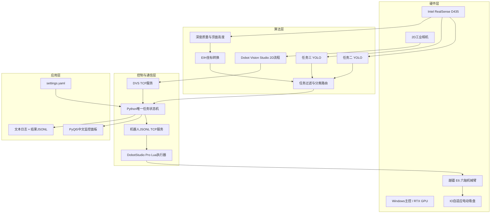
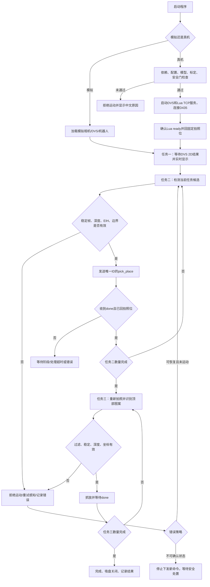
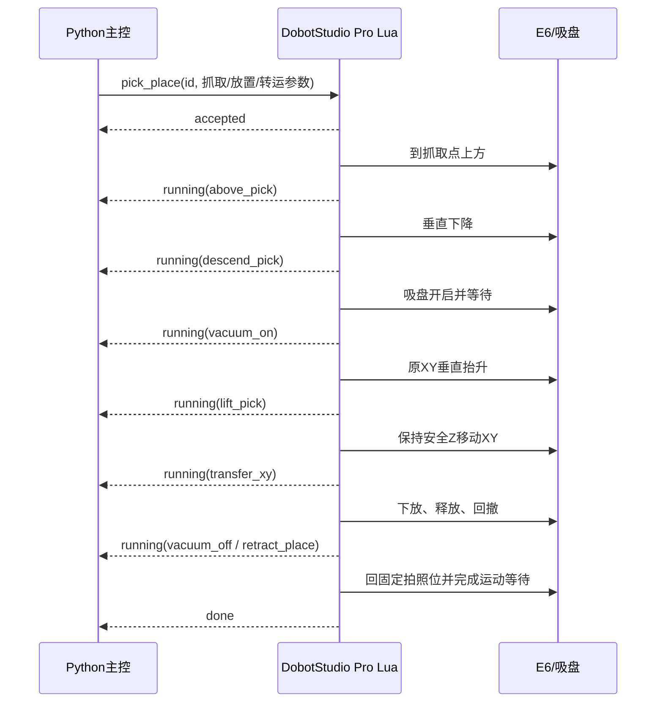

# 2026 睿抗机器视觉（越疆）系统设计说明

## 1. 文档目的

本文说明本项目的系统架构、任务状态机、视觉与深度算法、Eye-In-Hand 坐标转换、TCP 接口、机器人运动流程、异常处理、安全约束和验收方法，可作为赛题要求的设计报告技术底稿。

本文不替代比赛现场任务书。赛项规则中的场景图、工件图和尺寸图均为参考；现场发布的任务书、评分标准和裁判指令优先。最终提交报告应补充现场设备照片、实际网络参数、标定结果、误差统计、模型指标和运行截图。

## 2. 设计依据和硬性约束

### 2.1 任务约束

| 项目 | 规则要求 | 本系统落实方式 |
|---|---|---|
| 工件出现方式 | 评分时所有工件全程同时出现 | 当前任务类别过滤、数量约束和已处理集合共同隔离目标 |
| 大任务顺序 | 任务一 → 任务二 → 任务三 | 单一调度状态机，不允许并行运行或跳序 |
| 运行方式 | 启动后全自动，禁止人工干预 | 正式模式一次启动；所有目标选择、抓放和结束判定自动完成 |
| 运行时间 | 不超过 10 分钟 | 全局单调时钟超时 `600 s`，超时停止下发新任务 |
| 交互界面 | 实时显示识别工件信息 | PyQt5 中文监控面板显示图像、结果、坐标、状态和日志 |
| 网络环境 | 现场无云，端侧离线部署 | 模型、依赖、字体、标定和配置均放本地 |
| 硬件阶段 | 部署与连接 30 分钟 | 提供清单化部署和自检流程 |
| 开发联调 | 不超过 150 分钟 | 模块化配置、环境检查、模拟模式和分层验收 |
| 任务一 | 2D 标准平台软件识别尺寸/二维码/字符并输出 | DVS 通过 TCP 将结构化结果送入主控 |
| 任务二 | 2 件立方体/圆柱体，类型、颜色、1 件未知高度，抓取分类 | YOLO + D435 + EIH + Lua 抓放 |
| 任务三 | 顶部贴图，评分增加差异道具，模型综合判断并抓取分类 | 独立模型、任务过滤、类别/相似关系路由 |

### 2.2 规则未规定的内容

公开规则没有规定：

- 任务一具体尺寸字段和容差；
- 工件固定颜色集合和真实类别名；
- 任务二或任务三内部先抓哪件；
- 分类落点、机器人姿态、速度、抬升和下降距离；
- 固定拍照位或每次抓取后回拍照位；
- TCP IP、端口、报文、心跳、重试和确认机制；
- D435 的具体型号、相机序列号和流参数；
- PyQt5 作为唯一 UI 框架。

上述内容属于本项目工程实现或现场待填参数。特别是“固定拍照位 → 垂直抓取 → 原 XY 抬升 → 保持 Z 平移 → 下降释放 → 回拍照位”是用户选择的安全工作流，不是赛题强制动作。本系统将其参数化，是为了保持 EIH 变换条件一致并避免旧帧坐标错误。

## 3. 总体架构

### 3.1 分层架构



### 3.2 控制权原则

机械臂只能有一个实际运动控制者。本方案中：

- Python 负责感知、任务决策、坐标计算、工作空间初检和命令生命周期；
- DobotStudio Pro Lua 负责 E6 运动指令、运动完成等待、吸盘 IO 和执行阶段回报；
- 不在正式运行时同时使用 `TCP-IP-Python-V4` 直接控制机械臂；
- 自定义端口 `2006` 只是 Python 与 Lua 的应用协议端口，不是控制器的 `29999/30004` 端口。

这避免两套程序同时下发运动、状态不可追溯或停止语义冲突。

## 4. 逻辑模块

| 模块 | 职责 | 关键输出 |
|---|---|---|
| 配置模块 | UTF-8 YAML 读取、路径解析、结构校验、真机安全校验 | 只读 Settings |
| 环境自检 | 依赖、端口、标定文件、模型、现场必填参数检查 | 中文报告、是否允许进入下一层 |
| DVS TCP | 监听任务一结果，处理半包/粘包、编码、长度和字段校验 | 任务一结构化结果 |
| RealSense | 彩色/深度同步、深度对齐、运行时内参、旧帧冲洗 | 帧、深度尺度、内参 |
| YOLO | 任务二/三检测、类别过滤、置信度和候选排序 | Detection 列表 |
| 深度估计 | ROI/掩膜深度、时间中值、离群值、质量分 | 顶面深度与有效性 |
| EIH 标定 | OpenCV YAML 解析、刚体矩阵和单位校验、坐标链 | 机器人基坐标 X/Y/Z |
| 任务调度 | 固定顺序、数量、目标状态、单命令在途、结束判定 | PickTarget/任务状态 |
| Robot TCP | JSONL 编解码、空闲心跳、命令 ID、ACK/阶段/完成/错误 | RobotReply |
| Lua 执行器 | 工作空间复检、吸盘和抓放轨迹、回拍照位 | `accepted/running/done/error` |
| UI | 中文实时图像、检测、连接、任务、坐标和日志 | 人机可观察性 |
| 日志 | 过程日志和结构化结果，便于评分后追溯 | UTF-8 文件 |

模块之间只传数据结构，不让 UI 线程直接执行相机读取、模型推理或网络阻塞操作。

## 5. 完整工艺流程



### 5.1 任务一

1. Python 监听 DVS 端口并清除上轮未消费结果；
2. 单独运行任务一或进入全流程的任务一阶段时，Python 向 DVS 原样发送 UTF-8 字符串 `ok`（无换行）；发送失败则任务失败；
3. DVS 收到 `ok` 后完成尺寸、二维码、字符等检测；
4. DVS 发送一条以换行结束的结果；
5. Python 解码、解析、检查 `required_fields`；
6. UI 实时显示，结果写入 JSONL；
7. 达到 `expected_results` 后进入任务二。

任务一默认不运动机器人。现场任务若有额外要求，必须显式修改流程和报告。

### 5.2 任务二和任务三的单件循环

1. Lua 确认机器人处于固定拍照位并空闲；
2. 等待机械稳定，丢弃若干运动前旧帧；
3. 获取对齐的彩色/深度帧；
4. 用当前任务模型检测；
5. 按当前任务 `include/exclude`、类别和 ROI 过滤；
6. 经过连续稳定帧确认；
7. 从顶面 ROI/掩膜计算稳健深度；
8. 反投影并做 EIH 变换；
9. 使用台面高度公式计算吸盘抓取 Z；
10. 检查工作空间、物体高度、深度质量、目标重复和落点；
11. 生成唯一命令 ID 并发送 `pick_place`；
12. 等待 `accepted` 和 `running.phase`；
13. 只有收到 `done`，且 Lua 已经回拍照位并完成规定的运动等待，才把该件记为完成；
14. 重新拍照，不复用抓放前的检测框；
15. 每件完成后重新观察；连续多帧无当前任务目标，或完成数达到 `max_objects` 上限时，结束当前任务。

## 6. 状态机与并发

### 6.1 顶层状态

```text
IDLE
  → INITIALIZING
  → TASK1
  → TASK2
  → TASK3
  → COMPLETED
```

任意活动状态可进入：

```text
STOPPING → IDLE/FAILED
FAILED   → 仅在人工确认安全后重新初始化
```

不允许：

- TASK2 与 TASK3 并行；
- 运行中再次点击任务按钮创建第二执行线程；
- Lua 未 `done` 时发送下一件；
- 断线后猜测上一个动作未执行并自动重发；
- 软件停止后在 `finally` 中无条件回零或回拍照位。

### 6.2 机器人桥状态

```text
DISCONNECTED
  → CONNECTED
  → IDLE
  → ACCEPTED
  → RUNNING
  → DONE
  → IDLE
```

`RUNNING` 阶段：

```text
above_pick
descend_pick
vacuum_on
lift_pick
transfer_xy
descend_place
vacuum_off
retract_place
return_photo
```

异常进入 `ERROR`。错误是否可恢复由 Lua 报文 `recoverable` 给出，但“可恢复”只代表协议判断，不自动授权继续运动。

### 6.3 线程模型

- UI 主线程：只绘制和处理轻量用户事件；
- 相机/推理工作线程：生成最新可用帧和检测结果；
- DVS 服务线程：连接、收包、拆帧和结果事件；
- Robot TCP 线程：连接、应答、单命令等待和空闲 `ping/pong`；运动命令在途时不发送心跳；
- 唯一任务线程：顺序状态机和目标生命周期；
- 日志：线程安全 handler，UI 日志事件不反向打断业务。

所有跨线程 UI 更新使用信号或事件总线。图像队列应只保留最新帧，避免 UI 慢时积压旧帧。

## 7. 数据模型

### 7.1 Detection

检测结果至少包括：

- `task`、`object_id`；
- `class_name`、`confidence`；
- `bbox`、`pixel_center`；
- `color`、`shape`；
- `depth_mm`；
- `camera_xyz_mm`；
- `robot_xyz_mm`；
- `route_key`；
- 状态和扩展信息。

`object_id` 用于日志和本轮生命周期，不应只按类别命名。抓放后重新拍照，不能假定下一帧检测索引与上一帧相同。

### 7.2 PickTarget

下发前需要形成完整目标：

- 任务和唯一对象标识；
- 抓取 X/Y/Z；
- 明确抓取姿态 Rx/Ry/Rz；
- 放置 X/Y/Z；
- 明确放置姿态；
- 转运安全 Z；
- 速度、加速度、工具/用户坐标系；
- 路由键和命令 ID。

姿态应由 Python 配置后在报文中显式发送，不能让 Lua 隐式假设固定 `180/0/0`。

## 8. DVS TCP 接口

### 8.1 传输层

| 项目 | 约定 |
|---|---|
| 服务端 | Python |
| 客户端 | Dobot Vision Studio |
| 默认端口 | 6001 |
| 编码 | UTF-8，兼容 GB18030 |
| 帧边界 | 换行 `\n` |
| 最大单帧 | 65536 字节 |
| 断线半包 | 清除，不与新连接拼接 |

触发方向为 Python → DVS：任务一开始时发送两个 UTF-8 字节 `ok`，不附加换行。结果方向为 DVS → Python：DVS 收到 `ok` 后运行流程，并发送一条或多条以 `\n` 结束的任务一结果。

### 8.2 支持格式

推荐 JSON：

```json
{"version":1,"seq":1,"task":"task1","ok":true,"a":72.3,"b":145.1,"c":8.5,"unit":"mm","qr":"RAICOM2026","text":"E6"}
```

兼容 KV：

```text
TASK1,version=1,seq=1,ok=1,a=72.3,b=145.1,c=8.5,unit=mm,qr=RAICOM2026,text=E6
```

兼容纯 CSV：

```text
72.3,145.1,8.5
```

纯 CSV 解析为 `val0/val1/val2`，不适合正式评分。现场任务书确定后，必须设置 `dvs.required_fields`，拒绝缺字段结果。

### 8.3 质量检查

- 消息非空且未超长；
- 编码可解；
- JSON 顶层为对象；
- `task` 若存在必须是任务一；
- 数字有限且单位明确；
- `required_fields` 全部存在；
- `ok=false` 不进入任务完成；
- 重复 `seq` 记录但不重复计数。

## 9. Python ↔ Lua JSONL 协议

### 9.1 连接与帧

| 项目 | 约定 |
|---|---|
| 服务端 | Python 主程序 |
| 客户端 | DobotStudio Pro Lua |
| 默认端口 | 2006，自定义应用端口 |
| 编码 | UTF-8 |
| 格式 | 一行一个扁平 JSON |
| 位置/角度 | mm / degree |
| 并发 | 单命令在途 |
| 去重 | 同一 `id` 幂等 |

Lua 必须累积读取缓冲并按换行拆帧。JSON 中不发送嵌套数组并不是协议理论限制，而是为了适配 DobotStudio Pro Lua 环境并降低现场解析风险。

### 9.2 公共字段

- Python → Lua 命令均含 `v`（当前为 `1`）、唯一 `id` 和命令名 `cmd`；
- Lua → Python 应答保留同一 `id` 并使用 `status`；
- Lua 主动发送的启动 `HELLO` 是状态通知，没有 `cmd`。

启动就绪：

```json
{"v":1,"id":"HELLO","status":"ready","phase":"idle","model":"Dobot-E6"}
```

### 9.3 Python → Lua

`pick_place` 实际网络帧示例（线上必须压成一行，示例数值不可用于真机）：

```json
{"v":1,"id":"PICK-example","cmd":"pick_place","task":"task2","object_id":"task2-001","route_key":"red","pick_x":120.2,"pick_y":-85.4,"pick_z":132.0,"pick_rx":180.0,"pick_ry":0.0,"pick_rz":0.0,"place_x":250.0,"place_y":120.0,"place_down_mm":80.0,"place_z":132.0,"place_rx":180.0,"place_ry":0.0,"place_rz":0.0,"approach_z":172.0,"transfer_z":212.0,"retract_z":212.0,"photo_x":250.0,"photo_y":0.0,"photo_z":350.0,"photo_rx":180.0,"photo_ry":0.0,"photo_rz":0.0,"user":0,"tool":1,"travel_v":10,"pick_v":5,"accel":10,"settle_ms":300,"vacuum_api":"ToolDO","vacuum_io":1,"vacuum_on_level":1,"vacuum_off_level":0,"vacuum_suction_wait_ms":700,"vacuum_release_wait_ms":400,"vacuum_feedback_enabled":false,"vacuum_feedback_di":null,"vacuum_feedback_level":1,"vacuum_feedback_timeout_ms":1500}
```

动态目标字段：

- `pick_x/pick_y/pick_z/pick_rx/pick_ry/pick_rz`；
- `place_x/place_y/place_z/place_rx/place_ry/place_rz`；
- `place_down_mm`；
- `approach_z/transfer_z/retract_z`；
- `task/object_id/route_key`。

安全配置复核字段：

- `photo_x/photo_y/photo_z/photo_rx/photo_ry/photo_rz`；
- `user/tool`；
- `travel_v/pick_v/accel/settle_ms`；
- `vacuum_api/vacuum_io/vacuum_on_level/vacuum_off_level`；
- `vacuum_suction_wait_ms/vacuum_release_wait_ms`；
- `vacuum_feedback_enabled/vacuum_feedback_di/vacuum_feedback_level/vacuum_feedback_timeout_ms`。

Python 从 `settings.yaml` 计算抓取和派生 Z；Lua 以本地 `CFG` 重新计算并比较，同时检查所有派生轨迹点。缺字段、非有限数、坐标越界或配置不一致必须在 `accepted` 前返回错误，不能套用危险默认点位。

其他命令：

- `ping`：Python 仅在空闲且没有在途命令时自动发送，Lua 返回 `pong`；
- `go_photo`；
- `stop_after_current`：当前运动完成后停止后续任务，不抢断运动，也不改变当前吸盘输出。持件或异常保压时应隔离人员、防止工件坠落，再按现场安全流程人工处置，不得由普通停止命令自动断真空。

`go_photo` 的非公共字段为 `user/tool/travel_v/pick_v/accel/settle_ms`、全部吸盘复核字段以及 `photo_x/y/z/rx/ry/rz`。`pick_place` 在这组字段上增加任务元数据、抓取/放置六维位姿、`place_down_mm` 和 `approach_z/transfer_z/retract_z`。没有 `suction_off`、`go_home` 或软件 `emergency` 命令。

### 9.4 Lua → Python

应答保留同一 `id`，状态为：

- `accepted`；
- `running`，并带 `phase`；
- `done`；
- `error`，带 `code/message/recoverable`；
- `pong`。

Lua 本地 `CFG` 不完整时，连接后发送 `config_error` 而不是 `ready`。

`done` 的严格定义：工件已经释放，机械臂已经返回固定拍照位，脚本已经确认规定的运动等待完成。只完成释放但尚未回拍照位不能发送 `done`。

E6/V4.5 Lua 侧采用已核对的接口组合：

- `TCPCreate/TCPStart/TCPRead/TCPWrite/TCPDestroy`：应用 TCP 连接；
- 使用点位 table 的 `MovJ/MovL`：关节/直线运动；
- `CheckMovJ/CheckMovL`：正式下发前检查点位运动可达性；
- `Wait`：吸盘建立、释放和规定阶段等待；
- `ToolDO` 或 `DO`：现场二选一控制吸盘。

用户参考 Lua 文件中的 `TCPConnect/TCPRecv/Sync/SetIODO` 不属于本项目核对后的 E6/V4.5 接口，不能照抄。`Dobot Vision Studio 4.1.2` 是视觉平台版本，也不能据此推断 DobotStudio Pro 或控制器 Lua 的版本；三者必须分别核对。

### 9.5 超时、重连与幂等

- Python 超时后停止发送新命令；
- 不自动生成新 `id` 重发同一目标；
- Lua 默认保存最近 32 个终态 ID；相同 ID 与相同原始报文只回放结果，不再次运动，相同 ID 与不同报文返回冲突错误；
- 控制器或 Lua 工程重启会清空内存 ID 缓存，重启后必须人工核对未决动作；
- 断线后先确认机械臂实际状态，再建立 `IDLE/READY`；
- 不确定工件是否已抓走时，必须重新拍照和人工确认安全状态；
- `stop_after_current` 是受控停止请求，不等同实体急停，也不会改变吸盘输出；持件异常必须按现场安全流程人工处置。

## 10. D435 深度处理

### 10.1 对齐与运行时内参

YOLO 框来自彩色图，因此深度必须对齐到彩色流。反投影使用当前彩色流的 RealSense 运行时内参，不能无条件用 YAML 中旧分辨率的 `cameraInternalMatrix` 覆盖。

给定像素 `(u,v)`、深度 `d` 和内参 `(fx,fy,cx,cy)`：

```text
Xc = (u - cx) / fx × d
Yc = (v - cy) / fy × d
Zc = d
```

RealSense SDK 的反投影函数优先于手写公式，以保持畸变模型一致。

### 10.2 稳健深度

建议过程：

1. 在检测框中取内缩顶面区域，优先使用分割掩膜；
2. 剔除 0、NaN、无穷、超出范围的像素；
3. 对空间邻域取中位数；
4. 连续多帧取时间中位数；
5. 计算有效像素比例、MAD/方差和帧间变化；
6. 质量不达标时重新拍摄或报错，禁止猜测 Z。

圆柱边缘、孔洞、反光贴纸和黑色材料会增加无效深度，不能只使用中心单像素。

### 10.3 高度和抓取 Z

用户指定：

```text
h_object = z_table - z_surface
z_pick = z_touch + h_object - press_down
```

其中：

- `z_table`：固定拍照位空台面参考深度；
- `z_surface`：目标顶面深度；
- `z_touch`：吸盘刚贴台面时机器人 TCP Z；
- `press_down`：正数表示从理论顶面再向下压。

该公式假设机器人 Z 正方向向上。若现场坐标定义相反，不能只改公式符号后直接运行，必须用已知高度量块重新验证完整链路。

### 10.4 台面倾斜

单一 `table_depth_mm` 只适合较小且近似平行的工作区。更稳健方案：

- 采集空台参考深度图；或
- 在工作区拟合台面平面；
- 在目标 `(u,v)` 使用局部台面深度减顶面深度。

这可避免相机斜装或台面倾斜导致不同位置的高度系统误差。

## 11. EIH 标定和坐标转换

### 11.1 YAML 内容

项目关心：

- `cameraInternalMatrix`：标定时相机内参，仅用于核对；
- `distCoeffs`：标定时畸变；
- `CamToTipTransform`：4×4 外参；
- 文件中的时间、标定类型和相机名称用于追溯。

矩阵验收：

- 尺寸为 4×4；
- 元素有限；
- 末行为 `[0,0,0,1]`；
- 旋转子矩阵近似正交；
- `det(R)` 近似 `+1`；
- 平移量和单位符合物理安装；
- 相机名称、时间和现场设备相符。

### 11.2 变换链

若 `CamToTipTransform` 表示相机点到工具坐标：

```text
P_tip  = T_tip_camera × P_camera
P_base = T_base_tip   × P_tip
```

`T_base_tip` 由固定拍照位 `[X,Y,Z,Rx,Ry,Rz]` 形成。当前姿态约定为 `Rz @ Ry @ Rx`，即配置 `zyx`，但最终必须与 E6/DobotStudio Pro 的姿态定义实测一致。

如果已知点验证证明 YAML 实际保存相反方向，才设置 `invert_cam_to_tip: true`。不能仅凭节点名猜测。

### 11.3 XY 与 Z 的组合

本项目可使用完整 EIH 结果给出机器人 X/Y，同时按用户台面高度公式给出抓取 Z。原因是吸盘接触高度由“贴台 Z + 物体高度”直接表达，便于现场用量块验证。

建议把完整 EIH 变换得到的 Z 作为交叉检查：两种 Z 差异超过阈值时拒绝运动，并检查矩阵、桌面参考、工具长度或深度质量。

### 11.4 多点验收

至少选择工作区左上、右上、中心、左下、右下中的 3～5 点：

1. 机械臂低速指向已知点上方；
2. 记录视觉预测 X/Y；
3. 计算每点误差；
4. 检查误差是否随位置旋转、缩放或镜像；
5. 只有全部点满足现场评分容差才允许抓取。

单点补偿通过不代表 EIH 合格。

## 12. 目标选择、任务隔离和路由

### 12.1 所有工件同时出现

当前任务候选必须同时满足：

- 类别在当前任务白名单或关键字范围；
- 不在排除列表；
- 位于当前任务允许 ROI；
- 未在本轮已处理集合；
- 连续多帧稳定；
- 深度和机器人坐标有效；
- 有明确落点。

任务二完成判据不是整张桌面没有任何工件，任务三工件此时仍应存在。每次抓放后只重新寻找**任务二候选**：连续多帧没有候选时按实际数量结束，达到任务二独立配置的 `max_objects` 时也正常结束且不再抓取。任务三采用自己的 `max_objects` 和相同规则。两个上限均从 `settings.yaml` 读取，不在流程代码中写死。

### 12.2 候选顺序

公开规则不规定任务内部抓取顺序。本项目提供：

- `left_to_right`：便于稳定复现；
- `confidence`：优先高置信度；
- `nearest_center`：优先图像中心附近、深度通常更可靠。

现场任务书若规定顺序，应实现显式优先级，不能依赖检测器输出列表顺序。

### 12.3 分类路由

任务二可按 `color/shape/class`，任务三可按 `match_or_class`。路由键必须在 `robot.place_points` 中存在；未知键只有在现场允许时才能落到 `default`。正式评分建议对未知路由拒绝运动，避免放错区。

## 13. 机器人运动设计

### 13.1 单件抓放轨迹



### 13.2 双层校验

Python 下发前检查：

- 标定和深度有效；
- 抓取、转运、放置坐标均在工作空间；
- Z 高度和物体高度合理；
- 路由存在；
- 当前没有命令在途；
- 全局 600 秒未超时。

Lua 执行前再次检查：

- 协议版本、字段和数值有限；
- 当前为 `IDLE`；
- 抓取/放置/转运点在 Lua 安全边界；
- 速度、加速度在允许范围；
- 工具/用户坐标系有效；
- 吸盘 IO 已配置。

任一层失败都不得运动。

### 13.3 停止语义

- **正常停止：**不再接受新目标，必要时让当前安全段结束并吸盘保持受控状态；
- **通信故障：**Lua 不接受新运动；是否继续当前段按脚本安全策略；
- **机器人报警：**返回 error，不自动回拍照位；
- **实体危险：**使用机械臂实体急停；
- 软件停止后禁止在清理代码中无条件执行 `go_home`。

## 14. PyQt5 监控设计

### 14.1 中文显示

- 源文件、配置、日志统一 UTF-8；
- 使用可用的中文字体，如微软雅黑；
- 枚举值映射为中文，不直接显示内部英文状态；
- 无法解码的外部文本使用替换字符并保留原始字节摘要，不能让 UI 崩溃。

### 14.2 面板内容

| 区域 | 内容 |
|---|---|
| 总览 | 模拟/真机、当前任务、倒计时、进度、成功/失败数 |
| 连接 | DVS、D435、YOLO、Lua、机器人和吸盘状态 |
| 图像 | 彩色帧、检测框、类别、颜色、置信度、中心点 |
| 三维 | 深度质量、相机 XYZ、机器人 XYZ、物体高度 |
| 机器人 | 命令 ID、当前 phase、抓取点、落点、速度 |
| 任务一 | 原始 DVS 字段、尺寸、二维码、字符和校验结果 |
| 日志 | UTF-8 中文滚动日志、错误码和操作提示 |

正式运行中应禁用重复“开始”按钮和单任务手动按钮。停止按钮文案必须是“停止任务/停止运动”，不能误导为实体急停。

## 15. 配置与真机安全门

`settings.yaml` 中以下内容缺失时拒绝真机：

- 现场 EIH YAML；
- 任务二和任务三模型；
- 空台深度和吸盘贴台机器人 Z；
- 六维拍照位；
- X/Y/Z 工作空间；
- 任务二、三落点；
- Python PC IP；
- 吸盘 IO 通道。

Lua 文件顶部 `CFG` 还必须独立填写 PC IP/端口、用户/工具坐标系、拍照位、抓取姿态、工作空间、Z 正方向、运动上限和吸盘参数。Python 在命令中发送相同配置，Lua 与本地 `CFG` 二次比较；两边不一致时拒绝动作，以防只改了一个文件便静默使用旧安全参数。

结构校验还应覆盖：

- 端口在允许范围且可绑定；
- 总超时不大于 600 秒；
- `depth_patch_px` 为正奇数；
- 速度/加速度百分比合理；
- `min_object_height < max_object_height`；
- 工作空间最小值小于最大值；
- 放置点和抓取姿态数值完整。

每个实际会命中的 `robot.place_points.<task>.<route>` 都要独立填写 `x_mm/y_mm/down_mm`。`down_mm` 是该落料点从转运高度向下的距离；系统不设全局默认下降量，也不会在某个路由的 `down_mm` 缺失时静默回退，以免两套参数真值造成误放。

软件校验不能代替人工确认急停、工具、用户坐标系、实体边界和低速轨迹。

## 16. 日志和可追溯性

### 16.1 过程日志

记录：

- 时间、级别、模块、中文消息；
- 模式、配置文件路径和版本摘要；
- 连接/断线、相机和模型加载；
- 任务状态切换；
- 命令 ID 和 Lua 阶段；
- 超时、错误码和恢复决定。

采用轮转日志，防止长时间测试写满磁盘。

### 16.2 结果 JSONL

每个任务/工件建议保存：

- 时间戳、任务、运行批次；
- 原始检测类别/颜色/置信度/框；
- 原始和稳健深度、有效比例；
- 相机坐标、机器人坐标、抓取 Z 组成项；
- 标定文件时间/摘要；
- 路由和放置点；
- 机器人命令 ID、结果、耗时；
- 错误和是否计入完成。

日志用于复盘，不在正式运行中进行云端上传。

## 17. 异常处理

| 异常 | 策略 |
|---|---|
| DVS 断线/半包 | 清半包，等待重连；任务一未完成 |
| DVS 缺字段 | 显示具体字段，不计成功 |
| D435 未连接 | 真机启动失败；禁止用模拟数据替代 |
| 深度无效 | 重拍有限次数，仍失败则拒绝运动 |
| YOLO 无目标 | 连续多帧确认；不能因单帧漏检结束 |
| 类别路由未知 | 正式模式拒绝运动，等待规则允许的异常策略 |
| 标定矩阵异常 | 启动失败 |
| 坐标越界 | Python 和 Lua 均拒绝 |
| Lua ACK 超时 | 停止新命令，不自动重复抓取 |
| 运动中断线 | Lua 保持本地安全策略；恢复前确认实际位置 |
| 吸盘失败 | 若无真空反馈则按等待时间和视觉复检；不得假报成功 |
| 机器人报警 | 返回错误，禁止自动回位掩盖报警 |
| 全局超时 | 停止接受新目标，按安全策略结束当前动作 |
| UI 回调异常 | 记录但不反向破坏业务线程 |

异常恢复是否允许必须服从现场任务书和裁判。评分过程中不得通过人工移动工件或修改目标坐标恢复。

## 18. 性能与 10 分钟预算

建议监测：

- 相机有效帧率；
- YOLO 推理均值/P95；
- 深度多帧耗时；
- EIH 和路由耗时；
- DVS 往返；
- 单次机器人抓放耗时；
- 回拍照位稳定等待；
- 总流程单调时钟。

视觉优化不能以放松深度质量、减少稳定帧或跳过 `done` 为代价。若 GPU 回退 CPU 后无法保证 600 秒，应在赛前解决驱动/环境，而不是现场重装 Torch。

## 19. 测试与验收计划

### 19.1 单元测试

- OpenCV YAML 节点、矩阵尺寸、旋转正交性、单位转换；
- 深度中值、无效值、异常高度和 Z 公式；
- 反投影和矩阵正/逆方向；
- DVS JSON/KV/CSV、UTF-8/GB18030、半包、粘包、超长、重连；
- Robot JSONL 半包/粘包、重复 ID、状态顺序、超时；
- 类别过滤、路由、候选顺序和完成判据；
- `settings.yaml` 真机必填项。

### 19.2 仿真测试

- 不连接任何硬件，完整运行任务一至三；
- 所有模拟工件同时出现；
- 注入 DVS 断线、深度无效、模型无目标、Lua error；
- 验证停止时不会额外回位或继续抓取；
- 验证 UI 不卡死且日志完整。

### 19.3 离线视觉测试

- 使用 RealSense `.bag` 或录制彩色/深度数据；
- 不同光照、旋转、遮挡、相似图案和颜色；
- 统计 precision/recall、误检、漏检、深度有效率和推理时间。

### 19.4 标定验收

- 3～5 个桌面分布点 XY 误差；
- 多个已知高度量块 Z 误差；
- 固定拍照位重复 20～30 次的坐标标准差；
- 检查矩阵方向、单位和姿态顺序；
- 误差阈值以现场评分表为准。

### 19.5 机械臂分层测试

1. 仅 TCP hello/ping；
2. 吸盘关闭命令；
3. 不带工件的高位轨迹；
4. 单点低速抓放；
5. 单任务；
6. 所有工件同时出现的完整 1→2→3；
7. 断线、超时、停止和报警；
8. 连续多轮计时与重启。

## 20. 设计报告对应关系

| 赛题报告要求 | 本文位置 | 现场需补充 |
|---|---|---|
| 系统总体架构图 | 第 3 节 | 真实设备照片和接线图 |
| 硬件/算法/应用层 | 第 3～4 节 | 最终型号、版本、性能参数 |
| 软硬件选型依据 | 第 2、10、11、18 节 | 实测精度、稳定性、帧率 |
| 通信拓扑和数据流 | 第 3、8、9 节 | 最终 IP、端口、频率和抓包截图 |
| 完整工艺流程 | 第 5、13 节 | 现场任务字段和落料逻辑 |
| 触发与异常处理 | 第 6、17 节 | 裁判允许的恢复规则 |
| 图像到机器人链路 | 第 10～13 节 | 标定误差和坐标验证数据 |

## 21. 现场必填和最终签字项

### 21.1 视觉与任务

- [ ] 任务一测量字段、单位、容差、二维码/字符格式；
- [ ] 任务二和三的件数、类别、颜色、图案关系；
- [ ] 任务内抓取优先级和分类规则；
- [ ] YOLO 类别名与过滤关键字；
- [ ] 置信度、NMS、稳定帧和无目标判据；
- [ ] 每个路由键对应落料点。

### 21.2 D435 与标定

- [ ] 相机序列号、流参数、深度尺度；
- [ ] 现场 YAML、时间、相机名和矩阵节点；
- [ ] 变换方向、米/毫米和姿态顺序；
- [ ] 固定拍照位；
- [ ] 空台参考深度/参考平面；
- [ ] 吸盘贴台机器人 Z；
- [ ] 多点 XY、多高度 Z 验收数据。

### 21.3 机器人与网络

- [ ] PC、DVS、机器人网段和端口；
- [ ] 防火墙和端口占用；
- [ ] Lua 实际运动 API、用户/工具坐标系；
- [ ] 吸盘 API、通道、极性和等待；
- [ ] 工作空间、安全 Z、姿态、速度和加速度；
- [ ] 所有分类点和下降距离；
- [ ] 实体急停和控制器安全配置。

### 21.4 全流程

- [ ] 模拟完整通过；
- [ ] DVS 三种格式至少正式格式通过；
- [ ] Robot JSONL 半包、粘包和重复 ID 通过；
- [ ] 高位空跑、单点、单任务通过；
- [ ] 所有工件同时出现且严格 1→2→3；
- [ ] 一次启动后无人工干预；
- [ ] 完整运行小于 600 秒；
- [ ] 日志、UI和错误提示均为中文且无乱码；
- [ ] 服装、头发、电气、线缆和赛后清理符合规则。

只有全部关键项由操作者和安全监护人员确认后，才可进入正式真机运行。
